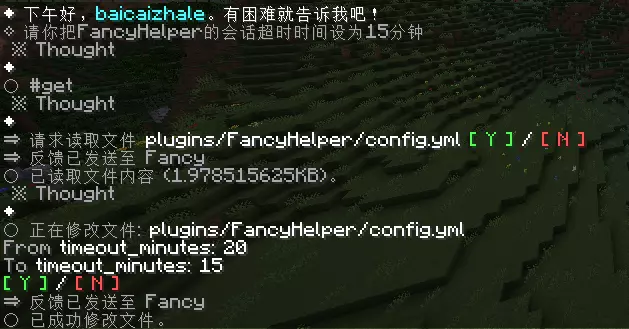

# FancyHelper


FancyHelper 是一款基于 AI 驱动的 Minecraft 服务器管理助手插件。它允许管理员通过简单的自然语言与 AI 对话，自动生成并执行复杂的服务器指令，极大地降低了插件学习成本和管理负担。

## ✨ 核心特性

- **💬 CLI 交互模式**：通过游戏内聊天框进入沉浸式对话，像和真人管理员交流一样管理服务器。
- **🧠 强力 AI 驱动**：接入 CloudFlare Workers AI，默认使用 `gpt-oss-120b` 大模型，理解意图更精准。
- **🔄 多 AI 提供商支持**：支持 CloudFlare Workers AI 和 OpenAI 兼容 API（OpenAI 官方、Azure OpenAI、DeepSeek、Ollama 等）。
- **🛡️ 安全执行机制**：AI 生成的指令需要玩家手动确认后才会执行，确保服务器安全。
- **⚡ YOLO 模式**：支持快速执行模式，大部分指令自动执行，高危命令仍需确认。
- **🎯 状态可视化**：使用动作栏实时显示 AI 生成状态（思考中、执行工具、等待确认等）。
- **🔍 智能文档搜索**：内置多种主流插件预设（LuckPerms, EssentialsX, WorldEdit 等），并支持在 Wiki 无结果时自动进行全网搜索。
- **📊 结果反馈闭环**：指令执行后的结果会自动反馈给 AI，使其能根据执行情况进行下一步操作或错误修正。
- **🔄 配置自愈**：支持配置文件版本检测与自动更新，无需担心插件升级导致的配置丢失。
- **🧹 旧插件清理**：自动清理旧版本的 MineAgent 插件文件，防止干扰。
- **🛡️ 防死循环检测**：自动检测 AI 陷入重复操作或过度调用，支持豁免机制。

## 📷 图片展示

<details>
<summary>点击展开/收起插件预览图</summary>





</details>


## 📋 要求

- **Java**: 17 或更高版本
- **服务器版本**: Spigot/Paper 1.18 - 1.21
- **网络**: 服务器需能访问 CloudFlare API 接口
- **依赖**: [ProtocolLib](https://www.spigotmc.org/resources/protocollib.1997/) 5.4.0+（用于命令输出捕获）

## 🚀 快速开始

### 1. 安装插件

1. 下载最新的 `FancyHelper.jar` 并放入服务器的 `plugins` 文件夹。
2. 推荐安装 [ProtocolLib](https://www.spigotmc.org/resources/protocollib.1997/) 插件以获得完整功能。
3. 重启服务器以生成默认配置文件。
4. 插件会自动清理旧版本的 FancyHelper 插件文件（如有），并将移动到 `plugins/FancyHelper/old/` 目录。

### 2. 配置 AI 服务 （可选）

#### CloudFlare Workers AI（默认）

1. 前往 [CloudFlare 控制台](https://dash.cloudflare.com/) 或[Key共享站](https://litemotto.is-a.dev/)获取你的 API Key。
2. 编辑 `plugins/FancyHelper/config.yml`：

   ```yaml
   cloudflare:
     cf_key: 你的_CLOUDFLARE_API_KEY
     model: "@cf/openai/gpt-oss-120b"
   ```

3. 在游戏中输入 `/fancyhelper reload` 重载配置。

#### OpenAI 兼容 API

插件也支持使用 OpenAI 兼容的 API，包括：
- OpenAI 官方（gpt-4o, gpt-4o-mini, o1-preview 等）
- DeepSeek（deepseek-chat, deepseek-reasoner）
- Ollama（本地模型）
- Azure OpenAI
- 其他兼容 OpenAI 格式的 API

在 `config.yml` 中配置：

```yaml
openai:
  enabled: true
  api_url: "https://api.openai.com/v1/chat/completions"
  api_key: "your-openai-api-key"
  model: "gpt-4o"
```

### 3. 使用方法

- 在游戏中输入 `/cli` 或 `/fancy` 进入 AI 对话模式。
- 直接输入你的需求，例如："给玩家 YanPl 设置为管理员组" 或 "在当前位置生成一个 10x10 的石头平台"。
- 预览 AI 生成的指令，确认无误后确认执行。

**交互指令**：
- `exit` - 退出 CLI 模式
- `stop` - 打断当前 AI 生成或取消待处理操作
- `y` / `n` - 确认或取消执行命令
- `agree` - 同意用户协议或 YOLO 协议

**YOLO 模式**：
- 输入 `agree` 同意 YOLO 协议后，大部分 AI 生成的指令会自动执行
- 但对于高风险命令（如 op、ban、stop、reload 等），仍需手动确认
- 风险命令列表可在 `config.yml` 的 `settings.yolo_risk_commands` 中配置


**读写文件功能**：
- AI 可以读取服务器上的任意文件，帮助分析配置、日志等
- AI 可以修改服务器上的配置文件，但需要玩家确认后才会执行
- 文件操作工具（ls、read、diff）会通过安全验证，确保不会操作敏感路径

## ⚠️ 常见问题

### ProtocolLib 依赖问题

FancyHelper 支持 [ProtocolLib](https://www.spigotmc.org/resources/protocollib.1997/) 作为依赖，用于以下功能：
- 命令输出捕获
- 系统消息拦截

**解决方案**：安装 [ProtocolLib](https://www.spigotmc.org/resources/protocollib.1997/) 插件以获得完整体验。

### 安全聊天警告

如果服务器日志中出现以下警告：

```
[WARN]: Failed to update secure chat state for <player>: 'Chat disabled due to missing profile public key. Please try reconnecting.'
```

**原因**：这是 Minecraft 服务器的安全聊天功能（`enforce-secure-profile`）产生的警告，不是 FancyHelper 插件的问题。当服务器启用了安全配置文件验证，但玩家的配置文件缺少公钥时就会出现此警告。

**解决方案**：
FancyHelper 会自动检测此问题并尝试将 `server.properties` 中的 `enforce-secure-profile` 设置为 `false`。如果自动修改成功，只需重启服务器即可。

如果自动修改失败，请手动执行以下步骤：

1. 打开服务器的 `server.properties` 文件
2. 将 `enforce-secure-profile` 设置为 `false`
3. 重启服务器

**注意**：此警告不影响 FancyHelper 的正常功能，可以安全忽略。

### 旧插件清理

插件启动时会自动清理旧版本的 Fancyhelper（或MineAgent） 插件文件，并将移动到 `plugins/FancyHelper/old/` 目录，防止干扰。

**注意事项**：

- 不会删除任何文件，只是移动到 old 目录
- 如果移动失败，会在日志中显示警告

## 🛠️ 指令与权限

| 指令 | 描述 | 默认权限 |
| :--- | :--- | :--- |
| `/fancyhelper` | 插件主指令 (别名: `/cli`, `/fancy`) | `fancyhelper.cli` |
| `/fancyhelper reload` | 重载插件配置 | `fancyhelper.reload` |

## 🛠️ 开发与构建

项目使用 Maven 进行管理。

```bash
git clone https://github.com/baicaizhale/FancyHelper.git
cd FancyHelper
mvn clean package
```

## ❤ 赞助我们

为铸FancyHelper，吾等焚膏继晷，兀兀穷年，耗尽心血。若此物有幸助君一臂之力，不知可否邀君共饮一杯薄酒，或赐一盏清茶之资？

**baicaizhale**

**zip8919**

---

**© 2026 baicaizhale. 保留所有权利。**