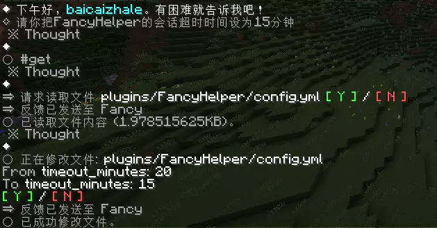

# FancyHelper


> 用说人话的方式管理你的 Minecraft 服务器。

[-D54B4B?style=flat)](README_LZH.md)
[-31C654?style=flat)](README_EN.md)

[](https://github.com/baicaizhale/FancyHelper/actions)
[](LICENSE)
[](https://github.com/baicaizhale/FancyHelper/stargazers)
[](https://github.com/baicaizhale/FancyHelper/issues)
[](https://fancy.baicaizhale.top/)

[](https://deepwiki.com/baicaizhale/Fancyhelper)

---

每次想给玩家调个权限、改个配置都要翻半天 Wiki？背指令背到头疼？

FancyHelper 就是来解决这个问题的。装好之后，你在游戏里直接跟 AI 说需求，比如"把 baicaizhale 设成管理员"，它会自己生成对应的指令，问你确认，然后执行。不用背指令，不用翻文档。

## 功能

- **聊天式管理** — 输入 `/cli` 进入对话模式，像跟真人管理员聊天一样管服务器
- **AI 自动生成指令** — 默认走 FancyConsole（免密钥中转），也支持 OpenAI、DeepSeek、CloudFlare Workers AI 等 OpenAI 兼容端点（BYOK 自带密钥）
- **四种对话模式** — **普通**模式每条指令都确认；**YOLO** 模式同意协议后自动执行，但 `op`、`ban`、`stop` 等高危操作仍会确认；**SMART** 模式由 AI 结合风险值自动判断，低风险直接执行；**Plan** 模式先规划后执行，适合复杂任务
- **执行前确认** — 普通模式下 AI 生成的指令默认需要手动确认（`y`/`n`）才会执行，不会乱来
- **实时状态条** — 动作栏显示 AI 当前在干嘛（思考中 / 执行中 / 等你确认），流式输出逐字展示
- **内置 Wiki 搜索** — 自带 LuckPerms、EssentialsX、WorldEdit 等主流插件的文档预设（Skills），搜不到还能自动全网搜（Tavily / Metaso）
- **Skill 技能系统** — 用 markdown 文档给 AI 注入指定插件的使用知识，支持在线市场一键安装更新
- **执行反馈闭环** — 指令跑完的结果会告诉 AI，错了它能自己改
- **文件操作工具** — 让 AI 读写服务器配置文件（`#read` / `#edit` / `#write`），首次使用需验证
- **MCP 客户端** — 连接外部 MCP 工具服务器，让 AI 调用任意外部工具扩展能力
- **待办清单** — AI 用 `#todo` 维护任务列表，书本内实时查看进度
- **偏好记忆** — AI 记住每位玩家的长期偏好（`#remember` / `#forget`）
- **会话恢复** — 对话记录持久化，`/cli resume` 随时接上上次没聊完的
- **自动更新** — 检测到新版本自动下载安装并热重载，无需重启服务器
- **多语言** — 插件界面支持简体中文 / English / 文言文，`config.yml` 一键切换
- **防死循环** — AI 如果开始重复操作或疯狂调用，会自动拦截

## 兼容性

| 服务端 | 版本 | Java |
|--------|------|------|
| Spigot | 1.18+ | 17+ |
| Paper（推荐） | 1.18+ | 17+ |

> 建议使用 Paper 及其下游分支（Purpur、Pufferfish 等）。Spigot 也能跑，但插件会在启动时给出警告，因为部分高级功能依赖 Paper 提供的 API。

**依赖：**
- [ProtocolLib](https://www.spigotmc.org/resources/protocollib.1997/) 5.4.0+ — **必需**，用于捕获命令输出和拦截系统消息。没有它会直接禁用插件。
  可以使用 `/fancy lib install protocollib` 命令自动下载安装（需要 OP 权限）。

## 演示

<video src="./pic/demo.mp4" controls width="100%" muted></video>

<details>
<summary>点击展开/收起插件预览图</summary>





</details>

## 快速开始

### 安装

1. 下载 `FancyHelper.jar`，丢进服务器的 `plugins` 文件夹
2. 同时装上依赖 ProtocolLib（注意对应你服务器的版本）
3. 重启服务器，配置文件会自动生成

### 配置 AI

插件默认使用 **FancyConsole**，开箱即用，但需要完成一次注册绑定：

1. 游戏里输入 `/cli`，点击消息里的链接前往注册页面
2. 注册完成后拿到 API Key，游戏里输入 `/cli bind <API Key>`
3. 绑定成功即可开始对话

**想用自己的 API Key（BYOK）：** 把 `config.yml` 里的 `provider.ai` 改成 `openai` 或 `cloudflare`，填好对应的 `api_key` / `cf_key`。

**CloudFlare Workers AI 配置：**
教程详见 [](https://blog.baicaizhale.top/post/create-cf-key-for-fhai)

**OpenAI 兼容 API（DeepSeek、OpenAI 等）：**
教程详见 [](https://blog.baicaizhale.top/post/openai-compatible-providers)

**MCP 工具服务器：**
教程详见 [](https://blog.baicaizhale.top/post/mcp-config)

### 开用

- 游戏里输 `/cli` 或 `/fancy` 进入 AI 对话模式
- 直接打字说需求，比如"在当前位置生成一个 10x10 的石头平台"
- AI 会生成指令，你看没问题就确认执行

**常用交互：**

| 输入 | 作用 |
|------|------|
| `exit` | 退出 CLI 模式 |
| `stop` | 打断 AI 或取消当前操作 |
| `y` / `n` | 确认 / 取消执行 |
| `agree` | 同意用户协议，或开启 YOLO 模式 |
| `/cli yolo` | 切换到 YOLO 模式（自动执行） |
| `/cli smart` | 切换到 SMART 模式（AI 判断风险） |
| `/cli plan` | 进入 Plan 规划模式 |
| `/cli retry` | 重试上一次的 AI 响应 |
| `/cli exempt_anti_loop` | 临时关闭防死循环检测 |
| `/cli resume` | 恢复上次的历史会话 |
| `/cli skill list` | 查看已安装的 Skill |
| `/cli todo` | 打开待办清单书本 |
| `!消息` | 以 `!` 开头直接发聊天消息，不走 AI |

## 指令与权限

| 指令 | 描述 | 默认权限 |
| :--- | :--- | :--- |
| `/fancyhelper` | 插件主指令（别名：`/cli`, `/fancy`） | `fancyhelper.cli` |
| `/fancyhelper bind <key>` | 绑定 FancyConsole API Key | OP |
| `/fancyhelper reload [target]` | 重载插件配置（可指定 `config` / `workspace` / `playerdata` / `skill` / `mcp` / `deeply`） | `fancyhelper.reload` |
| `/fancyhelper status` | 查看插件状态 | `fancyhelper.cli` |
| `/fancyhelper yolo` / `smart` / `normal` / `plan` | 切换对话模式 | `fancyhelper.cli` |
| `/fancyhelper settings` | 打开个人设置（流式输出、显示位置、声音等） | `fancyhelper.cli` |
| `/fancyhelper tools` | 管理文件操作工具（read / write）权限 | `fancyhelper.cli` |
| `/fancyhelper memory` | 管理 AI 偏好记忆 | `fancyhelper.cli` |
| `/fancyhelper resume` | 恢复历史会话 | `fancyhelper.cli` |
| `/fancyhelper todo` | 打开待办清单 | `fancyhelper.cli` |
| `/fancyhelper skill <list\|info\|load>` | Skill 技能列表 / 详情 / 加载 | `fancyhelper.skill.use` |
| `/fancyhelper skill <reload\|install\|upgrade>` | 管理 Skill（重载 / 安装 / 更新） | `fancyhelper.skill.admin` |
| `/fancyhelper mcp tools` | 查看 MCP 外部工具 | `fancyhelper.cli` |
| `/fancyhelper checkupdate` | 检查插件更新 | `fancyhelper.cli` |
| `/fancyhelper upgrade` | 下载并安装新版本 | `fancyhelper.reload` |
| `/fancyhelper notice` | 查看插件公告 | `fancyhelper.notice` |
| `/fancyhelper lib install protocollib` | 下载并安装 ProtocolLib 依赖 | OP |

| 权限 | 描述 | 默认 |
| :--- | :--- | :--- |
| `fancyhelper.cli` | 允许使用 CLI 模式 | OP |
| `fancyhelper.reload` | 允许重载配置 | OP |
| `fancyhelper.notice` | 允许查看插件公告 | OP |
| `fancyhelper.skill.use` | 允许使用技能命令 | OP |
| `fancyhelper.skill.admin` | 允许管理技能 | OP |

## 常见问题

**日志里刷 `[WARN]: Failed to update secure chat state for <player>: 'Chat disabled due to missing profile public key. Please try reconnecting.` 警告？**

这是 Minecraft 的 `enforce-secure-profile` 安全聊天验证导致的，不是本插件的锅。
FancyHelper 会自动尝试把 `server.properties` 里的这个选项改成 `false`，改完重启就好。如果自动改失败了，手动改一下再重启。

**报错说找不到 ProtocolLib / 插件加载失败？**

ProtocolLib 现在是 FancyHelper 的**必需依赖**。请从 [SpigotMC](https://www.spigotmc.org/resources/protocollib.1997/) 下载对应你服务端版本的 ProtocolLib，放进 `plugins` 文件夹后重启。也可以先用 OP 权限执行 `/fancy lib install protocollib` 自动安装。

## 贡献

- [报告 Bug](https://github.com/baicaizhale/FancyHelper/issues/new?template=错误报告.md&labels=bug)
- [请求功能](https://github.com/baicaizhale/FancyHelper/issues/new?template=功能请求.md&labels=enhancement)
- [提问](https://github.com/baicaizhale/FancyHelper/issues/new?template=询问问题.md&labels=question)
- PR 欢迎！从下方构建说明编译后提交即可。

## 支持

- [GitHub Issues](https://github.com/baicaizhale/FancyHelper/issues)

## 构建

```bash
git clone https://github.com/baicaizhale/FancyHelper.git
cd FancyHelper
mvn clean package
```

需要 Java 17 + Maven。

## 赞助我们

为铸 FancyHelper，吾等焚膏继晷，兀兀穷年，耗尽心血。若此物有幸助君一臂之力，不知可否邀君共饮一杯薄酒，或赐一盏清茶之资？

**baicaizhale**

**zip8919**

## Star History

[](https://www.star-history.com/?repos=baicaizhale%2FFancyHelper&type=date&legend=top-left)

---

**© 2026 baicaizhale. Licensed under GNU General Public License v3.0.**
