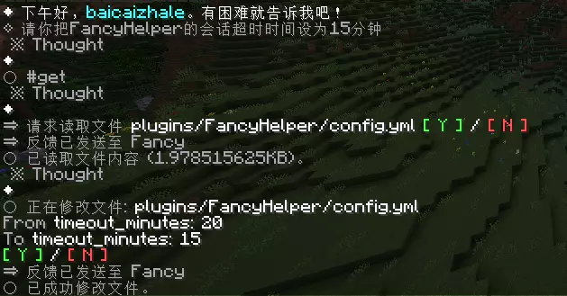
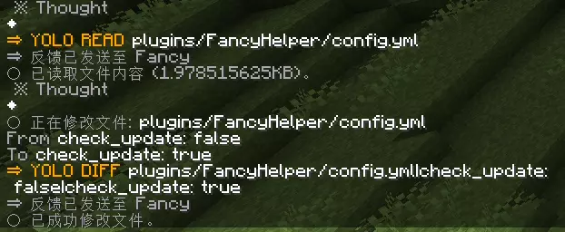

# FancyHelper


> Manage your Minecraft server with natural language.

Tired of digging through Wikis and memorizing complex commands just to change a permission or a config file?

FancyHelper is here to solve this problem. Once installed, you can talk directly to an AI in-game. For example, say "Set baicaizhale as admin," and it will generate the corresponding command, ask for your confirmation, and execute it. No more command memorization, no more manual searching.

---

## Features

- **Chat-based Management** — Type `/cli` to enter conversation mode. Manage your server as if you're chatting with a human co-admin.
- **AI Command Generation** — Integrated with CloudFlare Workers AI (default: `gpt-oss-120b`). You state the intent; it writes the command.
- **Multi-Model Support** — Supports CloudFlare, OpenAI, DeepSeek, Azure OpenAI, local Ollama models, and more.
- **Pre-execution Confirmation** — AI-generated commands require manual confirmation (`y`/`n`) by default to prevent accidents.
- **YOLO Mode** — Tired of confirming? After agreeing to the terms, most commands execute automatically, though high-risk operations like `op`, `ban`, and `stop` still require approval.
- **Real-time Status Bar** — The Action Bar displays what the AI is currently doing (Thinking / Executing / Waiting for confirmation).
- **Built-in Wiki Search** — Includes documentation presets for LuckPerms, EssentialsX, WorldEdit, and more. It can even search the web if not found locally.
- **Feedback Loop** — The output of executed commands is fed back to the AI. If something fails, the AI can correct itself.
- **Automatic Config Updates** — No need to manually edit configs during upgrades; it handles them automatically.
- **Anti-Loop Protection** — Automatically intercepts the AI if it starts repeating operations or making excessive calls.

## 📷 Gallery

<details>
<summary>Click to Expand/Collapse Preview Images</summary>







</details>

## Compatibility

| Server | Version | Java |
|--------|------|------|
| Spigot | 1.18+ | 17+ |
| Paper | 1.18+ | 17+ |

**Dependencies:**
- [ProtocolLib](https://www.spigotmc.org/resources/protocollib.1997/) 5.4.0+ (Highly recommended for capturing command output).

## Quick Start

### Download Plugin
<a href="[https://fancy.baicaizhale.top/](https://fancy.baicaizhale.top/)">
  
</a>

> 💡 Recommended to download the latest version for the newest features and fixes.

### Installation

1. Download the latest `FancyHelper.jar` and place it in the server's `plugins` folder.
2. Install the dependency ProtocolLib (For versions 26.1+, please use dev builds).
3. Restart the server; configuration files will be generated automatically.

### Configure AI (Optional, defaults to CloudFlare)

**CloudFlare Workers AI (Default):**
Obtain an API Key from the CloudFlare console or a shared key provider, then edit `plugins/FancyHelper/config.yml`:

```yaml
cloudflare:
  cf_key: YOUR_CLOUDFLARE_API_KEY
  model: "@cf/openai/gpt-oss-120b"
```

After editing, run `/fancyhelper reload` in-game to apply.

**OpenAI Compatible API:**
Supports official OpenAI, DeepSeek, Ollama local models, Azure OpenAI, etc. In `config.yml`:

```yaml
openai:
  enabled: true
  api_url: "https://api.openai.com/v1/chat/completions"
  api_key: "your-openai-api-key"
  model: "gpt-4o"
```

### Usage

- Enter `/cli` or `/fancy` in-game to start AI chat mode.
- Simply type your request, e.g., "Generate a 10x10 stone platform at my current location."
- The AI generates the command; confirm it to execute.

**Common Interactions:**

| Input | Effect |
|------|------|
| `exit` | Exit CLI mode |
| `stop` | Interrupt the AI or cancel current operation |
| `y` / `n` | Confirm / Cancel execution |
| `agree` | Agree to terms or enable YOLO mode |
| `/cli retry` | Retry the previous AI response |
| `/cli exempt_anti_loop` | Temporarily disable anti-loop detection |
| `!message` | Start with `!` to send normal chat messages, bypassing AI |


## FAQ

**Seeing `[WARN]: Failed to update secure chat state for <player>: 'Chat disabled due to missing profile public key. Please try reconnecting.` in logs?**

This is caused by Minecraft's `enforce-secure-profile` security setting, not the plugin itself.
FancyHelper will automatically attempt to set this to `false` in `server.properties`. Restart the server after the change. If it fails, edit manually and restart.

**Why install [ProtocolLib](https://www.spigotmc.org/resources/protocollib.1997/)?**

It's used to capture command output and intercept system messages. It works without it, but some features will be incomplete.
You can use the `/fancy lib install protocollib` command to download and install it automatically (OP permission required).

## Commands & Permissions

| Command | Description | Default Permission |
| :--- | :--- | :--- |
| `/fancyhelper` | Main command (Aliases: `/cli`, `/fancy`) | `fancyhelper.cli` |
| `/fancyhelper reload` | Reload plugin configuration | `fancyhelper.reload` |
| `/fancyhelper lib install protocollib` | Download and install ProtocolLib dependency | OP |

| Permission | Description | Default |
| :--- | :--- | :--- |
| `fancyhelper.cli` | Allows usage of CLI mode | OP |
| `fancyhelper.reload` | Allows reloading configuration | OP |
| `fancyhelper.notice` | Allows viewing plugin announcements | OP |

## Build

```bash
git clone https://github.com/baicaizhale/FancyHelper.git
cd FancyHelper
mvn clean package
```

Requires Java 17 + Maven.

## ❤ Sponsor Us

To create FancyHelper, we have burned the midnight oil and poured our hearts into it. If this tool helps you, would you consider inviting us for a drink or a cup of tea?

**baicaizhale**

**zip8919**

---

**© 2026 baicaizhale All Rights Reserved.**